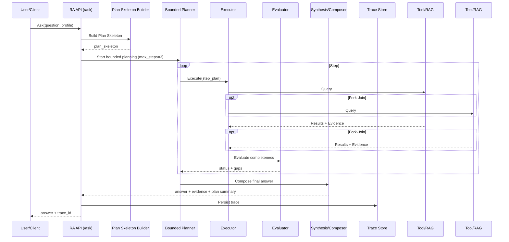
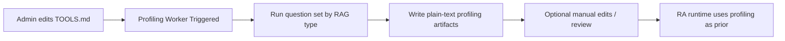

# Hybrid RAG+ Reference Agent (RA) PRD v2.0 (Formal)

> **Status**: v2.0 Final (Requirements Frozen)
> This document is the final v2.0 specification for Hybrid RAG+ Reference Agent and is the single source of truth for implementation and delivery.

> **Version**: v2.0  
> **Positioning**: Reference Agent (bounded planner + dependency-aware cross-RAG reasoner)  
> **Core Value Proposition**: Make “**dependency + cross-source comparison questions**” clearly better than parallel Hybrid RAG  
> **Hard Limit**: up to 3 queries (Step #1/#2 at most twice), no unbounded exploration  
> **Allowed Resources**: controlled first-party RAG + registered MCP tools (no Web Search/Crawling)

---

## 0. Summary & Baseline Decisions (v2)

### 0.1 v2 Overrides v1 When Conflicting
- Planner is allowed but must be **bounded** and outputs only the next-step plan
- Query Plan Skeleton is a first-class object (explicit, auditable, replayable)
- Profiling System included: TOOLS.md update triggers offline profiling; runtime probing only when missing
- Core capability: dependency-aware orchestration + cross-RAG synthesis (intersection, alignment, mapping)
- Evaluation stays simple: “sufficiently answers the original question” (complete/incomplete), no complex scoring

### 0.2 Definition of Success
- **Recall (highest)**: discover intersections (Example: A∩D) and required bindings (CVE/ID/time_range)
- **Accuracy (second)**: evidence-grounded, conflict/uncertainty disclosure
- **Performance (later)**: optimize within strict budgets

---

## 1. Positioning & Boundaries

### 1.1 One-liner
RA v2 is a **bounded planner** that completes **dependency-aware retrieval + cross-source comparison** within up to 3 queries, producing auditable reference answers.

### 1.2 Goals
- Clearly outperform parallel Hybrid RAG on dependency-heavy questions
- Explainable plans (Plan Skeleton) and replayable traces
- Multi-tool selection using summary/profiling priors (multi-V/multi-G/multi-S)
- Offline profiling (plain text, editable) to reduce runtime probing

### 1.3 Non-goals
- Web Search/Crawling
- Unbounded ReAct/self-reflection/multi-agent collaboration
- Dynamic tool discovery/recommendation/marketplace
- Arbitrary workflow designers and unlimited strategy expansion
- Platform-level multi-tenancy control plane (RBAC/billing/quotas)

---

## 2. System Overview (Core + Config + Adapter)

### 2.1 Core Service (RA v2)
- Plan Skeleton Builder
- Bounded Planner (≤3 queries)
- Strategy/Tool Selector (profiling/summary + rules)
- Executor
- Evaluator (sufficiently answers the original question?)
- Synthesis & Answer Composer
- Audit & Trace (replay)

### 2.2 Configuration
- `config.yaml`: daemon, TLS, auth, runtime limits, observability
- `TOOLS.md`: tool manifest (minimal summary)
- `profiles/*.yaml`: allowlists, limits, modes (demo/production)

### 2.3 MCP Adapter
- Thin wrapper to expose RA via MCP tools

---

## 3. Core User Stories

- Dependency-aware: discover keys first (CVE/entity_id/time_range), then targeted retrieval
- Cross-source comparison: compute intersections (Example: internal vulns ∩ external intel)
- Auditable: show evidence and explain plan/stop decisions
- Missing profiling: allow one-time probing to create a temporary profile

---

## 4. Query Model (Step #0–#3)

### 4.1 Step Rules
- Step #0 Plan Skeleton (once)
- Step #1 Execute+Evaluate
- Step #2 Execute+Evaluate
- Step #3 Compose Answer (final)

Max queries: 3 total (Step #0 is not a query)

### 4.2 Plan Skeleton Fields
- `answer_blueprint[]`
- `required_bindings[]`
- `candidate_tools[]`
- `constraints` (max_steps/max_tools_per_step/timeouts)
- `stop_conditions` (coverage/evidence/budget)

---

## 5. Strategy & Tool Selection

### 5.1 Fixed Strategy Templates
- T1 Key Discovery → Targeted Retrieval (G→V, S→V, V→G)
- T2 Narrowing → Deepening (limited) (V→V→G/V)
- T3 External Join (Fork-Join) (E || H / E || V/G/S)

Templates are finite; planner selects and parameterizes only.

### 5.2 Multi-tool Selection
- Prefer profiling/summary shortlist
- Tie-breaker: `profile.enabled_tools` order; optional `tool.priority`
- No unbounded probing for optimization unless demo probe-lite is explicitly enabled

---

## 6. Profiling System (v2 Core)

- TOOLS.md update triggers background profiling
- Output is plain text, editable, versionable
- Minimal manual field: `summary`
- Runtime: one-time probing only when profiling is missing and summary is insufficient

Profiling question sets vary by RAG type (Vector/Graph/SQL/External).

---

## 7. Evaluation (intentionally simple)

Check completeness via:
- Coverage (Answer Blueprint)
- Specificity (verifiable entities/time/IDs)
- Evidence (evidence_min + locator completeness)

Statuses: SUCCESS / PARTIAL / EMPTY / FAILED

---

## 8. Cross-RAG Synthesis (v2 Differentiation)

- Intersection (A∩D)
- Alignment (CVE ↔ ATT&CK)
- Mapping (vuln/technique ↔ internal policy/process/patch)

Conflicts and uncertainty must be disclosed.

---

## 9. Security & Deployment

- daemon: host/port, HTTP/HTTPS, TLS cert/key, timeouts, concurrency
- bearer token required; active+next rotation; never store token plaintext in traces

---

## 10. APIs

- `POST /ask`
- `GET /trace/{trace_id}`
- `POST /validate`
- `GET /capabilities`

---

## 11. Acceptance Criteria

1. Dependency-heavy questions solved within ≤3 queries
2. At least one cross-source comparison (Example: A∩D) with evidence
3. Replayable Plan Skeleton explaining gaps and step intent
4. Background profiling after TOOLS.md updates; editable output
5. One-time probing when profiling missing; persist results
6. Enforced hard budgets (steps/tools/timeouts)

---

## 12. Out of Scope (v2)
- Platform multi-tenancy control plane
- Web search, dynamic tool discovery
- Unbounded re-planning/probing/query loops
- Multi-agent collaboration / workflow designers

---

## 13. System Architecture

This section makes the “system overview” concrete by describing components and call relationships. v2 centers on **Query Plan Skeleton + Bounded Planner + Cross-RAG Synthesis**.

### 13.1 Component View
- **API Gateway / Service Daemon**
  - `/ask`, `/trace/{id}`, `/validate`, `/capabilities`
- **Plan Skeleton Builder**
  - Produces Answer Blueprint, required bindings, candidate tools, stop conditions
- **Bounded Planner**
  - Enforces at most 3 queries (no unbounded loops)
- **Strategy / Tool Selector**
  - Shortlists using summary/profiling priors and deterministic tie-breakers
- **Executor**
  - Invokes RAG/MCP tools (including fork-join)
- **Evaluator**
  - Determines “sufficient to answer the original question” (Coverage/Specificity/Evidence)
- **Synthesis & Answer Composer**
  - Intersection, alignment, mapping; conflict and gap disclosure
- **Audit & Trace Store**
  - Persists plan, per-step queries, results, evidence locators, rationale codes
- **Profiling Worker (Background)**
  - Triggered by TOOLS.md updates; outputs editable plain-text profiling artifacts

### 13.2 Sequence Overview


### 13.3 Background Profiling Triggered by TOOLS.md


---

## 14. User Flow and Data Flow

This section explains v2 from two angles: how users operate it, and how data/decisions move through the system.

### 14.1 User Flow
```mermaid
flowchart TD
  U[User asks a question] --> P[Select/apply Profile (demo/production)]
  P --> A[RA /ask]
  A --> R[Answer + trace_id]
  R --> V{Need validation?}
  V -- No --> Done[Done]
  V -- Yes --> Val[Call /validate or /trace]
  Val --> Done
```

### 14.2 Data / Decision Flow
```mermaid
flowchart LR
  Q[Original question] --> PS[Plan Skeleton Builder]
  PS --> S[Answer Blueprint + required bindings]
  S --> SEL[Tool/Strategy Selector<br/>(summary/profiling priors)]
  SEL --> PL[Bounded Planner<br/>(max_steps=3)]
  PL --> EX[Executor]
  EX --> R1[Tool Results + Evidence]
  R1 --> EV[Evaluator<br/>(coverage/specificity/evidence)]
  EV -->|complete| SY[Synthesis/Composer]
  EV -->|gaps| PL
  SY --> OUT[Final answer + Evidence Locators + Trace]
```

### 14.3 Audit/Trace View (what matters)
- **Plan Skeleton**: blueprint, bindings, candidate tools, stop conditions  
- **Step Plans**: per-step goals and dependency gaps  
- **Evidence Locators**: verifiable sources (doc id / chunk / URL / record key)  
- **Rationale Codes**: why a tool/template was chosen; why it stopped or downgraded to PARTIAL

---

# Appendix A: End-to-End Example (Illustrative Only, Not Requirements)