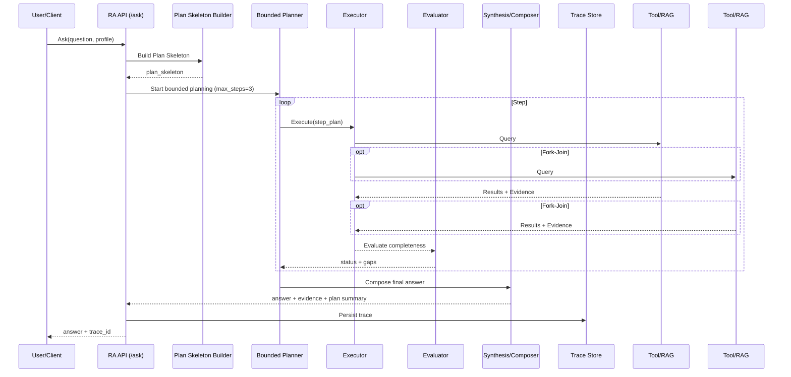
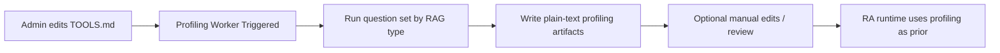
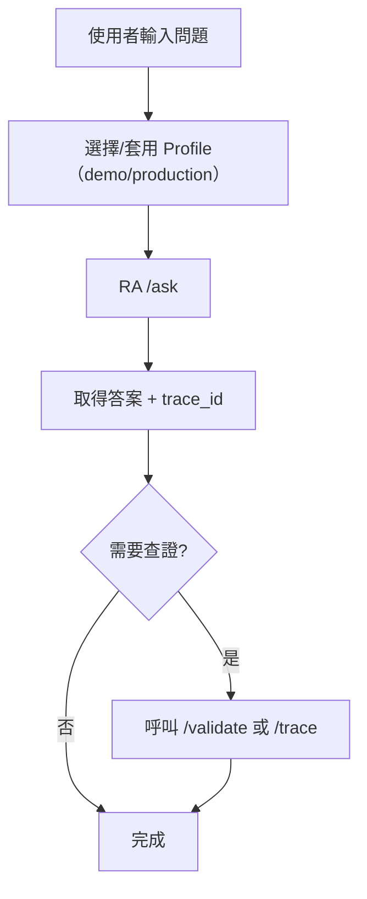

# Hybrid RAG+ Reference Agent（RA）PRD v2.0（正式版）

> **Status**：v2.0 Final（需求凍結）
> 本文件為 Hybrid RAG+ Reference Agent v2.0 的最終版本，作為實作、交付與對外說明之唯一依據。

> **版本**：v2.0  
> **產品定位**：Reference Agent（有界 Planner + 依賴式查詢與交叉比對的參考推理器）  
> **核心價值主張**：把「**需要依賴與交叉比對的問題**」做得比 Hybrid RAG（平行 Map-Reduce）**明顯更好**  
> **硬限制**：最多 3 次查詢（Step #1/#2 最多兩次），不可無限探索  
> **可用資源**：我方可控 RAG + 已註冊 MCP tools（不得 Web Search/Crawling）

---

## 0. 摘要與決策（v2 基準）

### 0.1 v2 取代/推翻 v1 的要點（若衝突以 v2 為準）
- **允許 Planner**：但必須是「有界（bounded）」且只輸出下一步查詢計畫，不得自由工作流
- **Query Plan Skeleton 成為一等公民**：顯式、可稽核、可回放
- **支援 Profiling System**：TOOLS.md 更新後觸發離線 profiling；runtime 僅在缺 profiling 時做一次性 probing
- **核心能力**：Dependency-aware orchestration + Cross-RAG synthesis（交集、對齊、映射）  
- **評估機制保持簡單**：以「是否能充分回答原始問題」為主（完成/未完成），不做複雜打分

### 0.2 成功定義
- **召回率（最優先）**：能找出跨多個 RAG 的關鍵交集（例如：A∩D）、補齊關鍵 bindings（CVE/ID/time_range）
- **準確率（次優先）**：證據可回查、衝突揭露、不確定性揭露
- **效能（較次要）**：在成本可控前提下優化（仍有硬上限避免失控）

---

## 1. 產品定位與邊界

### 1.1 一句話定位
RA v2 是一個「**有界 Planner**」，以最多 3 次查詢完成「**依賴式檢索 + 交叉比對**」，輸出可稽核的參考答案。

### 1.2 Goals
- 在依賴型問題上，顯著優於 Hybrid RAG 的平行查詢模式
- 具備可解釋的查詢計畫（Plan Skeleton）與可回放 trace
- 支援多個同類型工具（多 V/多 G/多 S）時的合理選源（以 summary/profiling 為先驗）
- 允許離線 profiling（明文可編輯），降低 runtime 探測成本

### 1.3 Non-goals（明確不做）
- Web Search / Crawling
- 無上限 ReAct / 自我反思 / 多 Agent 協作
- 動態工具探索、工具推薦、工具市場
- 任意 workflow 設計器與策略無限延伸
- 平台級多租戶（SaaS control plane：RBAC/帳務/配額）

---

## 2. 系統總覽（兩層 + Adapter）

### 2.1 Core Service（RA v2）
- Plan Skeleton Builder（回答藍圖與查詢骨架）
- Bounded Planner（最多 3 次查詢）
- Strategy/Tool Selector（依 profiling/summary + 規則）
- Executor（按計畫執行查詢）
- Evaluator（是否已足以回答原始問題）
- Synthesis & Answer Composer（交叉比對、整合、揭露衝突/缺口）
- Audit & Trace（完整回放）

### 2.2 Configuration Layer
- `config.yaml`：daemon、TLS、認證、runtime 上限、observability
- `TOOLS.md`：工具宣告（含最小 summary）
- `profiles/*.yaml`：允許工具、限制、模式（demo/production）

### 2.3 MCP Server Adapter（薄封裝）
- 將 RA 核心能力以 MCP tools 暴露（不含邏輯）

---

## 3. 主要使用者故事（User Stories）

### 3.1 依賴式查詢（核心）
- 作為使用者，我要 RA 能先從某個 RAG 找出關鍵 key（如 CVE/entity_id/time_range），再用該 key 去另一個 RAG 問出正確結果。
- 作為使用者，我要 RA 能做交集比對（例如：「內部弱點 ∩ 外部情資」），列出真正相關且嚴重的項目。

### 3.2 多來源整合（可稽核）
- 作為使用者，我要看到每個結論的 evidence 與 locator，並能理解「為什麼這樣查」與「為什麼停在這裡」。

### 3.3 無 profiling 的工具仍可用
- 作為管理者，我希望工具剛新增時沒有 profiling 結果也能工作：RA 可以對該工具做一次性 probing 生成臨時 summary。

---

## 4. 查詢模型（Step #0–#3）

### 4.1 Step 定義（硬規則）
- **Step #0：Plan Skeleton（只做一次）**  
  - 產出 Answer Blueprint（回答需求清單）、required bindings、候選工具、步數預算、停止條件
- **Step #1：Execute + Evaluate**  
  - 依計畫查詢並評估是否足以回答原始問題；若不足，規劃 Step #2
- **Step #2：Execute + Evaluate**  
  - 補齊缺口；若仍不足，可規劃 Step #3 的最後一次查詢計畫（視 profile 設定，預設不再查）
- **Step #3：Compose Answer（必定最後一步）**  
  - 綜整所有結果，輸出最終答案（揭露衝突與缺口）

> **最大查詢次數**：3（Step #1/#2/#3 中最多 3 次實際查詢；Step #0 不算查詢）

### 4.2 Plan Skeleton（v2 一等公民）
Plan Skeleton 至少包含：
- `answer_blueprint[]`：必須回答的子問題/要點（非任務分解，只是回答覆蓋）
- `required_bindings[]`：CVE / entity_id / time_range / doc_id 等
- `candidate_tools[]`：候選工具集合（受 profile 限制）
- `constraints`：max_steps / max_tools_per_step / timeouts
- `stop_conditions`：coverage complete / evidence_min met / step_budget exhausted

---

## 5. Strategy & Tool Selection（選源與策略）

### 5.1 核心策略模板（有限、可驗收）
- **T1 Key Discovery → Targeted Retrieval**（最常用）：G→V、S→V、V→G
- **T2 Narrowing → Deepening**（受限）：V→V→G/V
- **T3 External Join（Fork-Join）**：E || H（或 E || V/G/S）再合併

> 模板固定；planner 只能選模板並填參數，不得生成新模板。

### 5.2 多工具同類型的選源（避免盲選第一個）
- 優先用 profiling/summary shortlist  
- tie-breaker：
  - `profile.enabled_tools` 順序
  - 可選：`tool.priority`
- 禁止無上限探測所有工具最佳化（除非 demo mode 明確允許 probe-lite）

---

## 6. Profiling System（v2 新增核心能力）

### 6.1 觸發
- 手動更新 TOOLS.md 後觸發 profiling job（背景執行）
- 結果明文保存，可手動編輯、可版本控管

### 6.2 最小工具描述（Layer 1）
- TOOLS.md 每個 tool 只要求 1 個欄位：`summary`（或 `description`）
- profiling 可補 `profile_summary`（仍可手改）

### 6.3 Profiling Question Sets（依 RAG type）
- Vector：主題、樣例問題、filter、時間線索
- Graph：entity/relationship 類型、關聯問題類型
- SQL：指標/時間欄位線索、查詢樣式
- External：來源、更新頻率、限制

### 6.4 Runtime probing（僅補缺）
- 無 profiling 且 summary 不足時，對該 tool 做一次性 probing 生成臨時 profiling
- probing 結果保存並可手改，避免下次重複

---

## 7. Evaluation（刻意簡化）

只做完成度判斷：
- Coverage（回答藍圖覆蓋）
- Specificity（可驗證具體性：對象/時間/ID）
- Evidence（evidence_min + locator 完整）

狀態：SUCCESS / PARTIAL / EMPTY / FAILED

---

## 8. Cross-RAG Synthesis（v2 差異化核心）

- 交集（Intersection）：A∩D
- 對齊（Alignment）：CVE ↔ ATT&CK Technique
- 映射（Mapping）：弱點/技術 ↔ 內部政策/流程/修補

衝突與不確定性必須揭露，禁止硬合併成單一敘事。

---

## 9. 安全與部署（延續並強化）

- daemon：host/port、HTTP/HTTPS、TLS cert/key、timeouts、concurrency
- bearer token：必填；支援 active + next；trace 不記錄明碼 token

---

## 10. APIs（核心）

- `POST /ask`
- `GET /trace/{trace_id}`
- `POST /validate`
- `GET /capabilities`

---

## 11. 驗收標準（Acceptance Criteria）

1. 依賴型問題可於 ≤3 次查詢完成（key discovery → targeted retrieval）
2. 至少完成一種交叉比對（例如：A∩D）且可回查 evidence
3. Plan Skeleton 可回放並解釋每一步缺口與目的
4. TOOLS.md 更新後可背景產生 profiling（明文可手改）
5. 無 profiling 工具可一次性 probing 生成臨時摘要並保存
6. 嚴格執行硬上限：steps/tools/timeouts

---

## 12. Out of Scope（v2 不做）
- 平台級多租戶治理（RBAC/Quota/Billing）
- Web search、動態工具探索
- 無限 re-plan/probing/query loop
- 多 agent 協作平台與 workflow designer

---

## 13. 系統架構（Architecture）

本章節將「系統總覽」具象化為可實作的元件與呼叫關係，並強調 v2 的核心：**Query Plan Skeleton + Bounded Planner + Cross-RAG Synthesis**。

### 13.1 元件視圖（Component View）
- **API Gateway / Service Daemon**
  - `/ask`, `/trace/{id}`, `/validate`, `/capabilities`
- **Plan Skeleton Builder**
  - 產出 Answer Blueprint、required bindings、候選工具、停止條件
- **Bounded Planner**
  - 依 Plan Skeleton 控制最多 3 次查詢（不允許無限迴圈）
- **Strategy / Tool Selector**
  - 以 summary / profiling 為先驗做 shortlist，並套用 deterministic tie-breaker
- **Executor**
  - 依計畫呼叫各 RAG/MCP tool（含 fork-join）
- **Evaluator**
  - 判斷「是否足以回答原始問題」（Coverage/Specificity/Evidence）
- **Synthesis & Answer Composer**
  - 支援交集、對齊、映射；揭露衝突與缺口
- **Audit & Trace Store**
  - 保存 plan、每步 query、結果、evidence locator、決策理由碼
- **Profiling Worker（Background）**
  - TOOLS.md 更新觸發；產出明文 profiling 可手改

### 13.2 呼叫關係（Sequence Overview）


### 13.3 背景 Profiling（TOOLS.md 觸發）


---

## 14. User Flow 與 Data Flow

本章節從「使用者操作」與「資料在系統中的流動」兩個角度，幫助理解 v2 的運作方式。

### 14.1 User Flow（使用者流程）


### 14.2 Data Flow（資料/決策流）
```mermaid
flowchart LR
  Q[原始問題] --> PS[Plan Skeleton Builder]
  PS --> S[Answer Blueprint + required bindings]
  S --> SEL[Tool/Strategy Selector<br/>(summary/profiling priors)]
  SEL --> PL[Bounded Planner<br/>(max_steps=3)]
  PL --> EX[Executor]
  EX --> R1[Tool Results + Evidence]
  R1 --> EV[Evaluator<br/>(coverage/specificity/evidence)]
  EV -->|complete| SY[Synthesis/Composer]
  EV -->|gaps| PL
  SY --> OUT[最終答案 + Evidence Locators + Trace]
```

### 14.3 Trace 視角（可稽核重點）
- **Plan Skeleton**：回答藍圖、bindings、候選工具、停止條件  
- **Step Plans**：每一步的查詢目標與依賴（缺口）  
- **Evidence Locators**：可回查來源（doc id / chunk / URL / record key）  
- **Decision Rationale Codes**：為何選某工具/模板、為何停止/降級為 PARTIAL

---

# 附錄 A：端到端示例（僅供說明，非需求）