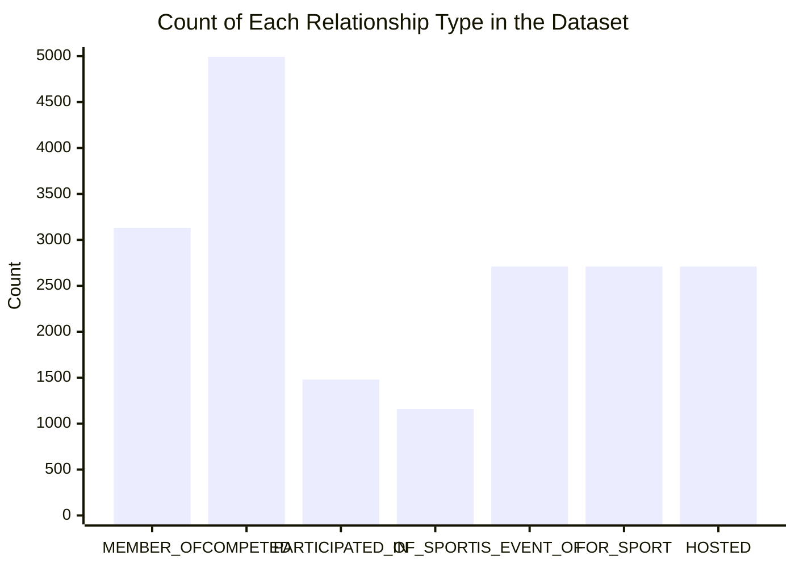

# Chat API (v1)

## Introduction

This section will describe Chat (Enterprise Q&A) of Gemini Enterprise customer-facing API (v1).

### Prerequisites

- Project API token: see `Customer-Facing API (v1)` for steps how to get one.
- Project with data, either graph and/or vector data.

## Endpoints

- The endpoint could be found here: `https://<DOMAIN>/api/docs/`
- Online Swagger documents could be found here: `https://cloud.geminidata.com/api/docs/`

## Operations

### 1. Create chat session

Use `POST /api/v1/chat/create` endpoint to create a new message, since all fields are optional, you can simply run:

```powershell
curl -X 'POST' \
  'https://demo.geminidata.com/api/v1/chat/create' \
  -H 'accept: */*' \
  -H 'Authorization: Bearer TOKEN' \
  -d ''
```

The expected answer includes the new chat ID:

```powershell
{
  "status": "success",
  "data": {
    "acknowledged": true,
    "insertedId": "68808a0e2766fdedf2b324a8"
  }
}
```

### 2. Send message

To send messages you need to use `POST /api/v1/chat/{id}` where {id} is the chat ID from `insertedId` in previous operation.

User question is sent as part of request body in a field `q` as below:

```powershell
curl -X 'POST' \
  'https://demo.geminidata.com/api/v1/chat/68808d102766fdedf2b324b0' \
  -H 'accept: */*' \
  -H 'Authorization: Bearer TOKEN' \
  -H 'Content-Type: application/json' \
  -d '{
  "q": "How many nodes we have in the dataset?",
  "streaming": false
}'
```

The response will include AI response and its message ID:

```json
  data: {
    "result": "The dataset contains a total of **6113 nodes**. \n\n| Metric        | Value |\n|---------------|-------|\n| Total Nodes   | 6113  |",
    "messageId": "68808e4f2766fdedf2b324b6"
}
```

Note:

- Response format is  `data: {"result": String, "messageId": String}` . Keep in mind when processing the answer, it starts with two spaces and data: prefix.
- Additiona fields may be returned, but they are deprecated and will not be returned in future versions of this API
- The `result` attribute is a string in Markdown format

### Streaming response

In example above, we set parameter `streaming` to **false** (line 8) to keep things simple. When `streaming` is set to **true**, the system will upgrade the current http connection to a SSE session and stream updates and response chunks until the full answer is available.

In this example we will ask a longer question with some prompting regarding the answer. And also set `streaming` as true:

```powershell
curl -X 'POST' \
  'https://demo.geminidata.com/api/v1/chat/68808d102766fdedf2b324b0' \
  -H 'accept: */*' \
  -H 'Authorization: Bearer TOKEN' \
  -H 'Content-Type: application/json' \
  -d '{
  "q": "How many relationships we have in the dataset? please return a table with the count of every relationship type and a chart",
  "streaming": true
}'
```

<aside>
💡

The response would be returned chunk by chunk, **it’s your responsibility to parse it accordingly**.

</aside>

Once the request has completed it will look as follows:

```json
data: {"userMessageId":"688091f32766fdedf2b324ba","messageId":"688091f32766fdedf2b324bc"}
data: {"progress":"analysing"}
data: {"progress":"searching"}
data: {"progress":"keepAlive"}
data: {"progress":"generating answer"}
data: {"chunk": ""}
data: {"chunk": ""}
data: {"chunk": "Here"}
data: {"chunk": " is"}
data: {"chunk": " a"}
data: {"chunk": " summary"}
data: {"chunk": " of"}
data: {"chunk": " the"}
data: {"chunk": " relationship"}
data: {"chunk": " types"}
data: {"chunk": " and"}
data: {"chunk": " their"}
data: {"chunk": " counts"}
data: {"chunk": " in"}
data: {"chunk": " the"}
data: {"chunk": " dataset"}
data: {"chunk": ":\n\n"}
data: {"chunk": "|"}
data: {"chunk": " Relationship"}
data: {"chunk": " Type"}
data: {"chunk": "  "}
data: {"chunk": " |"}
data: {"chunk": " Count"}
data: {"chunk": " |\n"}
data: {"chunk": "|"}
data: {"chunk": "----------------"}
data: {"chunk": "-----"}
data: {"chunk": "|"}
data: {"chunk": "-------"}
data: {"chunk": "|\n"}
data: {"chunk": "|"}
data: {"chunk": " MEMBER"}
data: {"chunk": "_OF"}
data: {"chunk": "          "}
data: {"chunk": " |"}
data: {"chunk": " "}
data: {"chunk": "313"}
data: {"chunk": "2"}
data: {"chunk": " "}
data: {"chunk": " |\n"}
data: {"chunk": "|"}
data: {"chunk": " COMP"}
data: {"chunk": "ET"}
data: {"chunk": "ED"}
data: {"chunk": "           "}
data: {"chunk": " |"}
data: {"chunk": " "}
data: {"chunk": "499"}
data: {"chunk": "3"}
data: {"chunk": " "}
data: {"chunk": " |\n"}
data: {"chunk": "|"}
data: {"chunk": " PARTIC"}
data: {"chunk": "IP"}
data: {"chunk": "ATED"}
data: {"chunk": "_IN"}
data: {"chunk": "    "}
data: {"chunk": " |"}
data: {"chunk": " "}
data: {"chunk": "147"}
data: {"chunk": "9"}
data: {"chunk": " "}
data: {"chunk": " |\n"}
data: {"chunk": "|"}
data: {"chunk": " OF"}
data: {"chunk": "_S"}
data: {"chunk": "PORT"}
data: {"chunk": "           "}
data: {"chunk": " |"}
data: {"chunk": " "}
data: {"chunk": "116"}
data: {"chunk": "0"}
data: {"chunk": " "}
data: {"chunk": " |\n"}
data: {"chunk": "|"}
data: {"chunk": " IS"}
data: {"chunk": "_EVENT"}
data: {"chunk": "_OF"}
data: {"chunk": "        "}
data: {"chunk": " |"}
data: {"chunk": " "}
data: {"chunk": "271"}
data: {"chunk": "0"}
data: {"chunk": " "}
data: {"chunk": " |\n"}
data: {"chunk": "|"}
data: {"chunk": " FOR"}
data: {"chunk": "_S"}
data: {"chunk": "PORT"}
data: {"chunk": "          "}
data: {"chunk": " |"}
data: {"chunk": " "}
data: {"chunk": "271"}
data: {"chunk": "0"}
data: {"chunk": " "}
data: {"chunk": " |\n"}
data: {"chunk": "|"}
data: {"chunk": " HOST"}
data: {"chunk": "ED"}
data: {"chunk": "             "}
data: {"chunk": " |"}
data: {"chunk": " "}
data: {"chunk": "271"}
data: {"chunk": "0"}
data: {"chunk": " "}
data: {"chunk": " |\n\n"}
data: {"chunk": "```"}
data: {"chunk": "chart"}
data: {"chunk": "\n"}
data: {"chunk": "b"}
data: {"chunk": "arch"}
data: {"chunk": "art"}
data: {"chunk": ":"}
data: {"chunk": " Count"}
data: {"chunk": " of"}
data: {"chunk": " Each"}
data: {"chunk": " Relationship"}
data: {"chunk": " Type"}
data: {"chunk": " in"}
data: {"chunk": " the"}
data: {"chunk": " Dataset"}
data: {"chunk": "\n"}
data: {"chunk": "```"}
data: {"chunk": ""}
data: {"chunk": ""}
data: {"result":"Here is a summary of the relationship types and their counts in the dataset:\n\n| Relationship Type   | Count |\n|---------------------|-------|\n| MEMBER_OF           | 3132  |\n| COMPETED            | 4993  |\n| PARTICIPATED_IN     | 1479  |\n| OF_SPORT            | 1160  |\n| IS_EVENT_OF         | 2710  |\n| FOR_SPORT           | 2710  |\n| HOSTED              | 2710  |\n\n```chart\nbarchart: Count of Each Relationship Type in the Dataset\n```","messageId":"688091f32766fdedf2b324bc","cyphers":[{"id":1,"title":"Count the number of each relationship type in the dataset and return a table with the counts, as well as a chart visualization.","cypher":"MATCH ()-[r]->()\nRETURN type(r) AS relationship_type, count(r) AS count","data":[{"relationship_type":"MEMBER_OF","count":3132},{"relationship_type":"COMPETED","count":4993},{"relationship_type":"PARTICIPATED_IN","count":1479},{"relationship_type":"OF_SPORT","count":1160},{"relationship_type":"IS_EVENT_OF","count":2710},{"relationship_type":"FOR_SPORT","count":2710},{"relationship_type":"HOSTED","count":2710}]}]}
```

Note:

- **line 1:** the system acknowledges your request and preemptively sends the answer’s message ID
- **lines 2 to 10:** the system sends updates of its reasoning progress
- **lines 11 to 135:** the systems sends answers as chunks (when assembled together this is a Markdown string)
- **line 136:** the system sends the full answer (same as previous example when streaming is disabled)

### 3. Get chart data

Charts in Gemini Enterprise need to be processed separately from the original AI response. This reduces prompt complexity and helps AI to focus on answering first, and formatting later.

The sharp eyed reader would notice we asked for a chart in the previous example, let’s take a look at the response (after assembling and formatting):

```
Here is a summary of the relationship types and their counts in the dataset:
| Relationship Type   | Count |
|---------------------|-------|
| MEMBER_OF           | 3132  |
| COMPETED            | 4993  |
| PARTICIPATED_IN     | 1479  |
| OF_SPORT            | 1160  |
| IS_EVENT_OF         | 2710  |
| FOR_SPORT           | 2710  |
| HOSTED              | 2710  |
```chart
barchart: Count of Each Relationship Type in the Dataset
```
```

The last section of this response is what we call **chart flag**. The chart flag is a placeholder that indicates API clients that chart data should be fetched on a separate request.

<aside>
💡

An answer may contain more than one chart flag.

</aside>

- The chart flag always starts with ````chart` and ends with `````
- The text between those prefix and postfix is the chart type and its title

To fetch chart data use `POST /api/v1/chat/{id}/{messageId}/chartgen` endpoint, where {id} is your chat session ID, and {messageId} is the answer’s ID returned at the beginning and end of the request.

The chart generation request for the previous example would be as follows:

```powershell
curl -X 'POST' \
  'https://demo.geminidata.com/api/v1/chat/68808d102766fdedf2b324b0/688091f32766fdedf2b324bc/chartgen' \
  -H 'accept: */*' \
  -H 'Authorization: Bearer TOKEN' \
  -H 'Content-Type: application/json' \
  -d '{
  "chartFlag": "barchart: Count of Each Relationship Type in the Dataset"
}'
```

The answer to such request would be in [mermaid](https://mermaid.js.org/) format:

```json
{
  "status": "success",
  "data": "```mermaid\nxychart-beta\n    title \"Count of Each Relationship Type in the Dataset\"\n    x-axis [\"MEMBER_OF\", \"COMPETED\", \"PARTICIPATED_IN\", \"OF_SPORT\", \"IS_EVENT_OF\", \"FOR_SPORT\", \"HOSTED\"]\n    y-axis \"Count\" 0 --> 5000\n    bar \"Relationship Count\" [3132, 4993, 1479, 1160, 2710, 2710, 2710]\n```"
}
```

When formatted it looks like:

```

```

Once parsed it should look as follows:


There are many mermaid libraries available in javascript, python and other languages that allow further chat formatting and customization. Some Markdown interpreters also support mermaid syntax natively.

<aside>
💡

Is up to API clients to decide how to handle the **chart flag** either:

- avoid displaying it,
- replace it with chart text, or
- replace it with fully rendered chart
</aside>

### 4. Other operations

### Get chat list

Use `GET` `/api/v1/chat/list` endpoint (no parameters):

```powershell
curl -X 'GET' \
  'https://demo.geminidata.com/api/v1/chat/list' \
  -H 'accept: */*' \
  -H 'Authorization: Bearer TOKEN'
```

With response:

```json
{
  "status": "success",
  "data": [
    {
      "_id": "68808d102766fdedf2b324b0",
      "title": "Untitled (d057d)",
      "type": "private",
      "owner": "62d9e67e308cf1002de45804",
      "bookmarked": false,
      "customization": {
        "enableTable": false,
        "enableBarChart": false,
        "enableFlowChart": false,
        "enableLineChart": false,
        "enablePieChart": false
      },
      "createdAt": "2025-07-23T07:19:44.166Z",
      "updatedAt": "2025-07-23T07:19:44.166Z",
      "__v": 0
    }
  ]
}
```

### Get chat’s messages

Use `GET` `/api/v1/chat/{id}/messages` endpoint (no parameters):

```powershell
curl -X 'GET' \
  'https://demo.geminidata.com/api/v1/chat/68808d102766fdedf2b324b0/messages' \
  -H 'accept: */*' \
  -H 'Authorization: Bearer TOKEN'
```

### Delete chat session

Use `POST` `/api/v1/chat/{id}/remove` endpoint (no parameters):

```powershell
curl -X 'POST' \
  'https://demo.geminidata.com/api/v1/chat/68808d102766fdedf2b324b0/remove' \
  -H 'accept: */*' \
  -H 'Authorization: Bearer TOKEN' \
  -d ''
```

With response:

```json
{
  "status": "success",
  "data": {
    "status": "ok"
  }
}
```